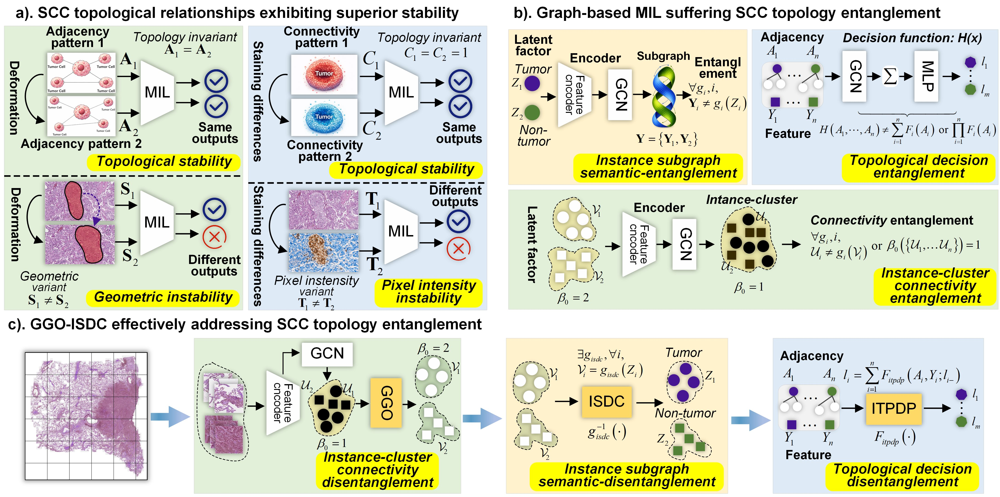
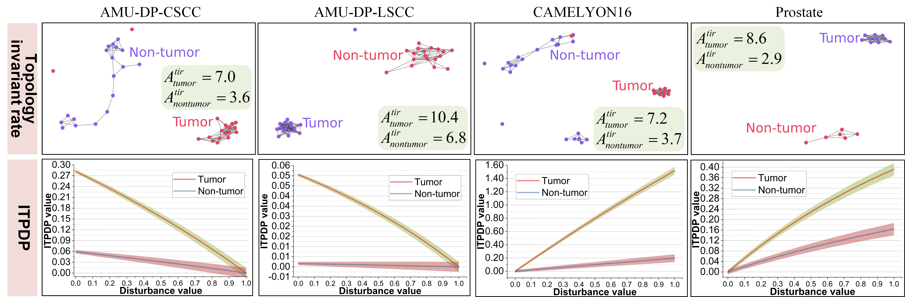

# Graph Game Optimization-driven Instance Subgraph-density Disentanglement Clustering for Learning Explainable Topology-invariant

## 🧔: Authors [*Corresponding author]
Pan Huang, _Member, IEEE_, Xinwei Zhang, Lan Wang, Xinyu Hao*, _Member, IEEE_, and Jing Qin*, _Senior Member, IEEE_

## :fire: News

- [xxx/xxx/xxx] xxx.


## :rocket: Pipeline

Here's a motivation of our **Graph Game Optimization-driven Instance Subgraph-density Disentanglement Clustering (GGO-ISDC)** method:



Here are the statistically interpretable results of our **GGO-ISDC** method:



Here are the visually interpretable results of our **GGO-ISDC** method:


## :mag: TODO
<font color="red">**We are currently organizing all the code. Stay tuned!**</font>
- [x] training code
- [x] Evaluation code
- [x] Model code
- [ ] Pretrained weights
- [ ] Datasets


## 🛠️ Getting Started

To get started with GGO-ISDC, follow the installation instructions below.

1.  Clone the repo

```sh
git clone https://github.com/Braon-Huang/GGO-ISDC
```

2. Install dependencies
   
```sh
pip install -r requirements.txt
```

3. Training on Swin Transformer-S Backbone
```sh
sh run_swinT.sh
Modify: --abla_type sota --run_mode train --random_seed ${seed}
```

4. Evaluation
```sh
sh run_swinT.sh
Modify: --abla_type sota --run_mode test --random_seed ${seed}
```

5. Extract features for plots
```sh
sh run_swinT.sh
Modify: --abla_type sota --run_mode test --random_seed ${seed} --feat_extract
```

6. Interpretability plots
```sh
sh run_swinT.sh
Modify: --abla_type sota --run_mode test --random_seed ${seed} --bag_weight
```

## :postbox: Contact
If you have any questions, please contact [Dr.Pan Huang](https://scholar.google.com/citations?user=V_7bX4QAAAAJ&hl=zh-CN) (`panhuang@polyu.edu.hk`).
